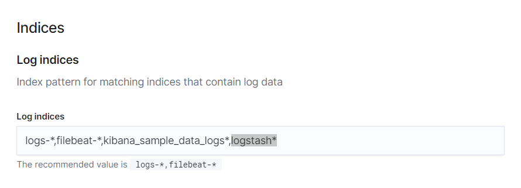

_**Este repositorio está en desarrollo**_
# Shop core
> Este proyecto es el microservicio principal del proyecto Shop. Se encarga de acceder a la db, comunicarse con otros microservicios a través de eventos...
 
# Tabla de contenidos

- [Arquitectura](#Arquitectura)
- [Configuración](#Configuración)
- [Ejecución](#Ejecución)
  - [Testing](#Testing)
- [Generar Cliente](#Generar-cliente)
- [Urls](#Urls)

# Arquitectura

[Basada en](https://github.com/DomingoAlvarez99/shop#De-cada-miroservicio)

# Configuración

- [db](src/main/resources/postgres) Lanzar las sentencias para crear las bases de datos, usuarios, tablas..

## Sonarqube

- Crear proyecto en sonarqube.
  1. Iniciar sesión
      <details><summary>Credenciales usuario por defecto</summary>
      <p>

       - Username: admin
       - Password: admin

      </p>
      </details>
  2. [Crear proyecto](http://localhost:9000/projects/create) 
- [pom.xml](pom.xml) Editar las propiedades del perfil de sonar.

## Kibana

- Añadir el índice declarado en [logstash.conf](logstash/logstash.conf) en la [configuración de kibana](http://localhost:5601/app/logs/settings).
  

# Ejecución

- Arrancar la base de datos: `> docker-compose up -d postgres`
- Arrancar sonarqube: `> docker-compose up -d sonarqube`
- Arrancar elk: `> docker-compose up -d elasticsearch logstash kibana`
- Arrancar la aplicación en un contenedor: `> docker-compose up -d spring`
- Arrancar el proyecto en local: 
   - `> mvn clean install`
   - `> mvn spring-boot:run`

## Testing

- Ejecutar tests: `> mvn test`
- Generar métricas: `> mvn verify`
- Enviar las métricas a SonarQube: 
   - `> mvn sonar:sonar` (Las propiedades se deben de haber añadido previamente en el perfil de sonar del [pom.xml](pom.xml))
   - ```bash
     mvn sonar:sonar \
             -Dsonar.projectKey=${KEY} \
             -Dsonar.host.url=${HOST} \
             -Dsonar.login=${TOKEN}
     ```
- Realizar las 2 cosas: `> mvn verify sonar:sonar`

# Generar Cliente

 1. Descargar la especificación `> wget -P /generated/swagger-api http://localhost:8080/api/v0/api-docs -O api-docs.json`
 2. Generar el cliente 
 ```bash
 > mvn clean install
 > cd /target/generated-sources-swagger-api
 > mvn clean install
 ```

# Urls

- [Api](http://localhost:8080/api/v0)
- [Api doc](http://localhost:8080/api/v0/swagger-ui.html)
- [Api spec](http://localhost:8080/api/v0/api-docs)
- [Sonar](http://localhost:9000/projects)
- [Kibana](http://localhost:5601/)
